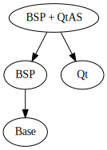

Manifest structure
==================

The structure for manifests are created with the following requirements:

1. When adding or refactoring the baseline, the number of files needed to edit
   should be as low as possible.
2. The number of manifests files needed per supported hardware target should
   be as low as possible.

Structure
---------

In the above image, `Base` is the manifest file containing mappings to the git
repositories which are required by every PELUX build (i.e. `PELUX-base.xml`).
`Qt` is the manifest file that contain mappings to the git repositories required
in every PELUX QtAS build which is not already covered in `Base`.

In contrast to `Base` and `Qt` there are multiple instances of `BSP` and
`BSP + QtAS`. However, each such instance holds mappings to git repositories
required by specific hardware target. This means that there is no one `BSP`
or `BSP + QtAS` manifest file, but one file each per hardware target. An example
of this are `pelux-intel.xml` and `pelux-intel-qt.xml`this which represent
specific implementations of `BSP` and `BSP + QtAS` for the intel hardware target.

Using this structure, a minimal number of manifest files needs to be created in
the repository.
